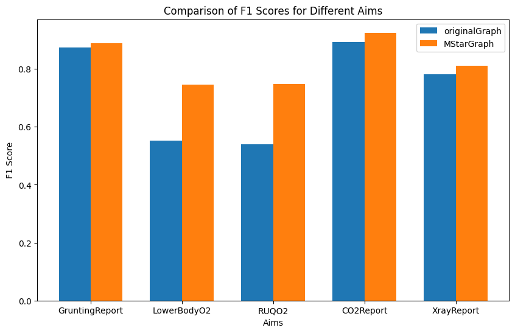

# 总体思路

第一步：首先，探索构建$M^*$算法的方式

第二步：然后，对$M^*$算法进行测试。具体而言，使用现有的贝叶斯网络G进行数据采样，反演出原样本数据，然后使用$M^*$算法构建新网络G1，对G和G1进行模型推理测试，比较评测指标。

第三步：最后，使用构建好的$M^*$算法在电诈数据集上使用即可

# 项目记录

## 2024.11.23

第一步和第二步已经完成，但是$M^*$模型效果不及预期：


当前的M*算法很简单，核心建图就是用最直接的Prompt：

```py
def generate_BNN_MStar(nodes_name_lst, nodes_info_list) -> BayesianNetwork:
    """
    输入网络节点信息和解释，输出网络结构
    :param nodes_name_lst: 网络节点名称
    :param nodes_info_list: 网络节点信息
    :return: 网络结构
    """
    web_llm = init_LLM()
    web_llm.open_history_log()

    Zone = '保险领域'

    merge_info = [nodes_name_lst[i] + ":" + nodes_info_list[i] for i in range(len(nodes_info_list))]

    identity_prompt = f"你是一个{Zone}的专家，你需要用你的专业知识解决如下的问题："
    problem_prompt = "你需要根据提供的信息，给出一个最合理的网络结构，这些信息包括节点名称和节点含义的详细解释"
    info_prompt = f"节点的名称和含义的详细解释为：{merge_info}"
    CoT_prompt = "你需要一步一步的进行思考并且将你的思考过程展示出来。具体来说，你可以先对节点进行分层，然后再构建拓扑"

    prompt = identity_prompt + problem_prompt + info_prompt + CoT_prompt
    print('waiting for LLM response of M*(stage 1/2):')
    response = web_llm.response_only_text(web_llm.generate_msg(prompt))

    mission_prompt = "现在结合你的思考过程，将网络的结构总结汇总。"
    structure_prompt = "最后返回的网络拓扑格式有特殊要求。举个例子，对于一个三个节点的网络，拓扑为A到B，B到C，则返回：[('A', 'B'),('B','C')]。你本次的返回值只应该包含网络拓扑列表，不要返回其他任何的多余字符。"

    prompt1 = mission_prompt + structure_prompt
    print('waiting for LLM response of M*(stage 2/2)')
    response1 = web_llm.response_only_text(web_llm.generate_msg(prompt1))

    while 1:
        try:
            raw_BNN = eval(response1)
            BN_Structure = BayesianNetwork(raw_BNN)
            break
        except Exception as e:
            print(e)
            Error_prompt = f"你给的网络拓扑格式有误，解析时报错如下：{e}，请重新生成。"
            response1 = web_llm.response_only_text(web_llm.generate_msg(Error_prompt))


    return BN_Structure
```

## 2024.11.24

用小的贝叶斯网络测试，发现$M^*$能直接复原出原图，这应该是因为有知识背景，所以能直接复原出原图。但是对于大的网络，$M^*$算法效果不好，就和上面的一样。

用$M^*$算法搞出来的Asia图长这样：


和官方的图一模一样。

现阶段，小网络的数据污染问题先不管，先管大网络的问题。

大网络用$M^*$算法，现阶段还存在一些问题，最突出的一个就是构建出来的网络结构是非法的，这意味着网络要么不联通要么有环或者要么有些点丢掉了。

针对这种情况，应该设置第三个Prompt，对网络结构进行修改。

## 2024.11.25

记录一个实验现象：

MStar生成的Child网络如下所示：

```plain text
[('BirthAsphyxia', 'LVH'),
 ('BirthAsphyxia', 'DuctFlow'),
 ('BirthAsphyxia', 'CardiacMixing'),
 ('BirthAsphyxia', 'LungParench'),
 ('BirthAsphyxia', 'LungFlow'),
 ('BirthAsphyxia', 'HypDistrib'),
 ('BirthAsphyxia', 'HypoxiaInO2'),
 ('BirthAsphyxia', 'CO2'),
 ('BirthAsphyxia', 'LowerBodyO2'),
 ('BirthAsphyxia', 'RUQO2'),
 ('LVH', 'Grunting'),
 ('LVH', 'ChestXray'),
 ('LVH', 'CO2Report'),
 ('LVH', 'XrayReport'),
 ('LVH', 'GruntingReport'),
 ('LVH', 'Sick'),
 ('LVH', 'LVHreport'),
 ('DuctFlow', 'Grunting'),
 ('DuctFlow', 'ChestXray'),
 ('DuctFlow', 'CO2Report'),
 ('DuctFlow', 'XrayReport'),
 ('DuctFlow', 'GruntingReport'),
 ('DuctFlow', 'Sick'),
 ('CardiacMixing', 'Grunting'),
 ('CardiacMixing', 'ChestXray'),
 ('CardiacMixing', 'CO2Report'),
 ('CardiacMixing', 'XrayReport'),
 ('CardiacMixing', 'GruntingReport'),
 ('CardiacMixing', 'Sick'),
 ('LungParench', 'Grunting'),
 ('LungParench', 'ChestXray'),
 ('LungParench', 'CO2Report'),
 ('LungParench', 'XrayReport'),
 ('LungParench', 'GruntingReport'),
 ('LungParench', 'Sick'),
 ('LungFlow', 'Grunting'),
 ('LungFlow', 'ChestXray'),
 ('LungFlow', 'CO2Report'),
 ('LungFlow', 'XrayReport'),
 ('LungFlow', 'GruntingReport'),
 ('LungFlow', 'Sick'),
 ('HypDistrib', 'Grunting'),
 ('HypDistrib', 'ChestXray'),
 ('HypDistrib', 'CO2Report'),
 ('HypDistrib', 'XrayReport'),
 ('HypDistrib', 'GruntingReport'),
 ('HypDistrib', 'Sick'),
 ('HypoxiaInO2', 'Grunting'),
 ('HypoxiaInO2', 'ChestXray'),
 ('HypoxiaInO2', 'CO2Report'),
 ('HypoxiaInO2', 'XrayReport'),
 ('HypoxiaInO2', 'GruntingReport'),
 ('HypoxiaInO2', 'Sick'),
 ('CO2', 'Grunting'),
 ('CO2', 'ChestXray'),
 ('CO2', 'CO2Report'),
 ('CO2', 'XrayReport'),
 ('CO2', 'GruntingReport'),
 ('CO2', 'Sick'),
 ('LowerBodyO2', 'Grunting'),
 ('LowerBodyO2', 'ChestXray'),
 ('LowerBodyO2', 'CO2Report'),
 ('LowerBodyO2', 'XrayReport'),
 ('LowerBodyO2', 'GruntingReport'),
 ('LowerBodyO2', 'Sick'),
 ('RUQO2', 'Grunting'),
 ('RUQO2', 'ChestXray'),
 ('RUQO2', 'CO2Report'),
 ('RUQO2', 'XrayReport'),
 ('RUQO2', 'GruntingReport'),
 ('RUQO2', 'Sick'),
 ('Disease', 'LVH'),
 ('Disease', 'DuctFlow'),
 ('Disease', 'CardiacMixing'),
 ('Disease', 'LungParench'),
 ('Disease', 'LungFlow'),
 ('Disease', 'HypDistrib'),
 ('Disease', 'HypoxiaInO2'),
 ('Disease', 'CO2'),
 ('Disease', 'LowerBodyO2'),
 ('Disease', 'RUQO2'),
 ('Age', 'Sick')]
```

长这样：


该网络对反演数据（5000样本）的预测效果在某些节点上比原网络好：


10000样本的预测效果如下：


1000样本的预测效果如下：



500样本的预测效果如下：


将样本量减少到100个效果如下，发现效果好了更多：


规律很明显，样本量越小，两种方法的差距越大。

此时将原网络用全量数据训练得到的CPT换成官方的CPT，500个样本的预测效果对比如下：


这是不是意味着官方给出的网络结构在推理上并非最优？如何验证呢？